# Lab2Web
# Membuat HTML
- Untuk melakukan praktik CSS, yang kita butuhkan pertamakali yaitu membuat HTML, contohnya sebagai berikut
- 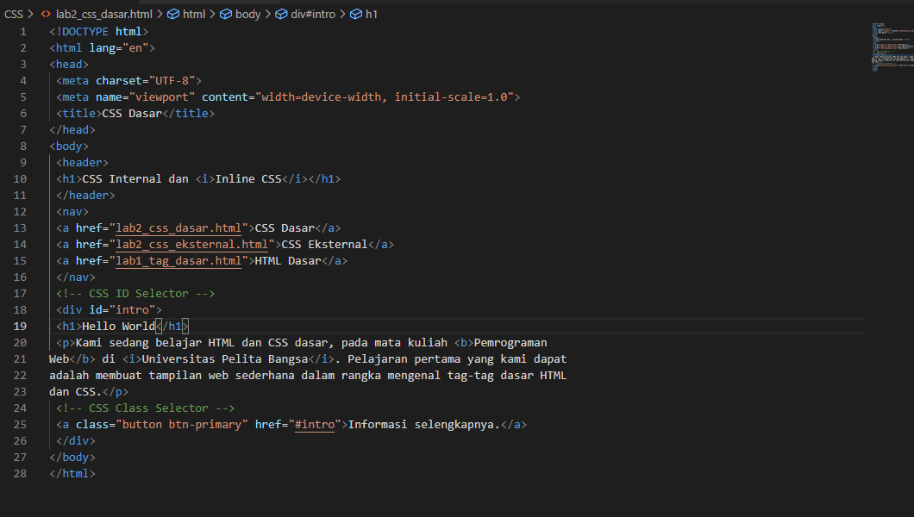
- Nanti hasilnya seperti sebelumnya, berikut hasilnya
- 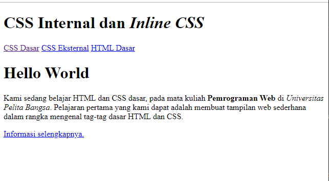
- nah kemudian kita akan mendeklarasikan internal CSS, berikut source code nya :
- 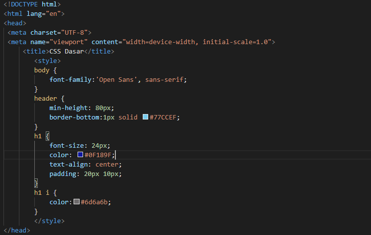
- Nanti hasilnya akan menjadi seperti ini
- 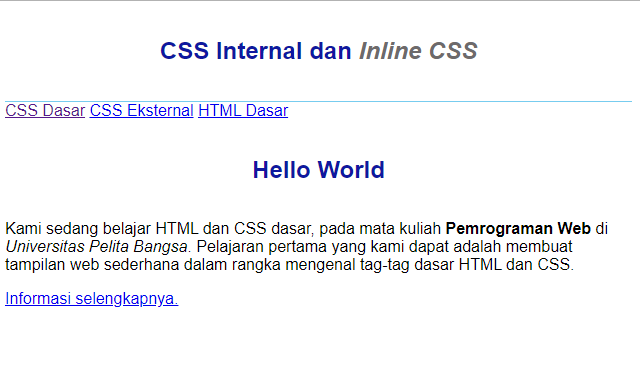
- Lalu kita akan menambahkan inline CSS, dengan source code berikut
- 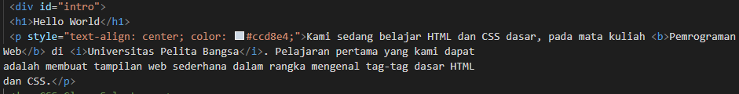
- Cukup mudah, ini adalah hasilnya :
- 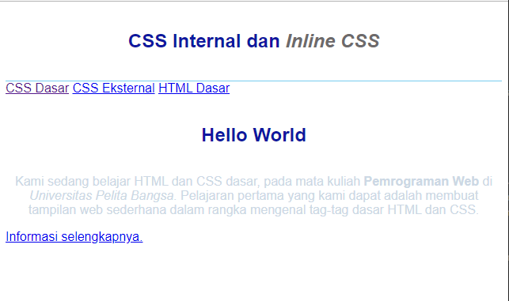
- Selanjutnya kita akan lanjut ke eksternal CSS , setelah membuat file dengan format .css, kemudian masukan source code nya:
- 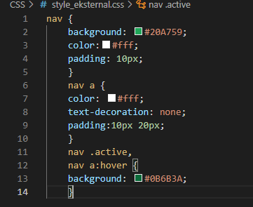
- Sebelumnya saya akan tambahkan tag link untuk merujuk pada file css yang sudah dibuat, source code nya yang paling bawah di ss berikut
- 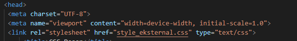
- Jika tidak diberi tag link, eksternal CSS tidak akan bekerja
- Setelah itu, inilah hasil setelah kita tambahkan eksternal CSS
- 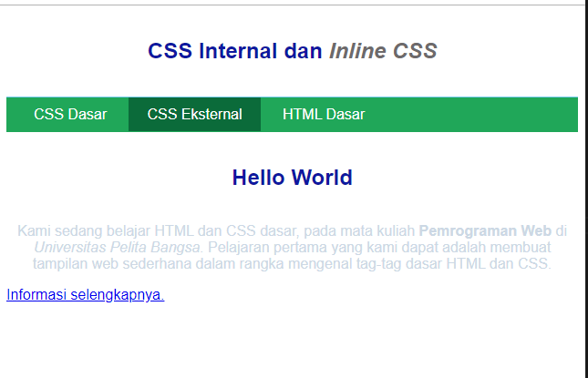
- Setelah itu, kita akan membuat CSS selector untuk melengkapi praktik CSS ini
- 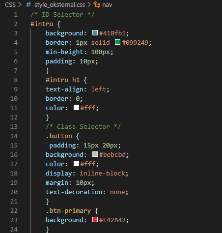
- Ikuti source code diatas, kemudian hasilnya akan seperti ini
- 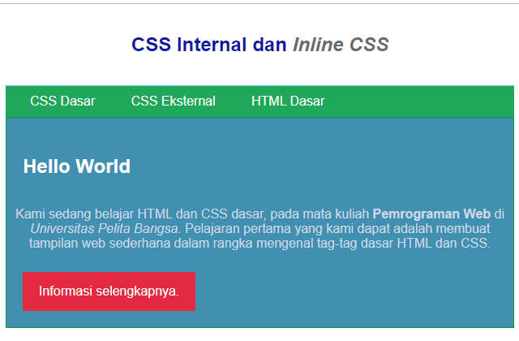
- Pada VSC kita dapat mengganti warna dengan mudah, cukup arahkan saja kursornya ke kotak warna, kemudian ada pop up muncul, dan kita bisa meng adjust warna yang kita inginkan
